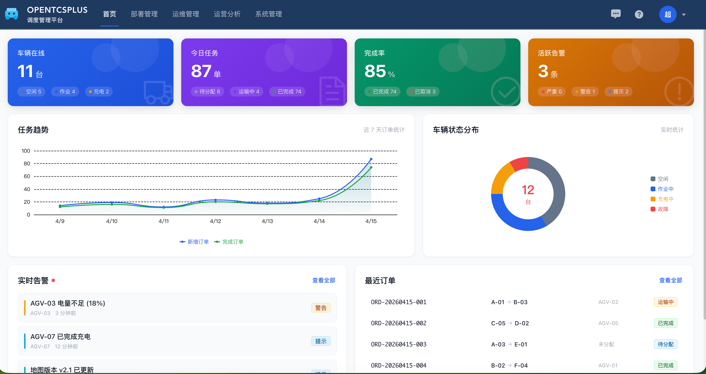
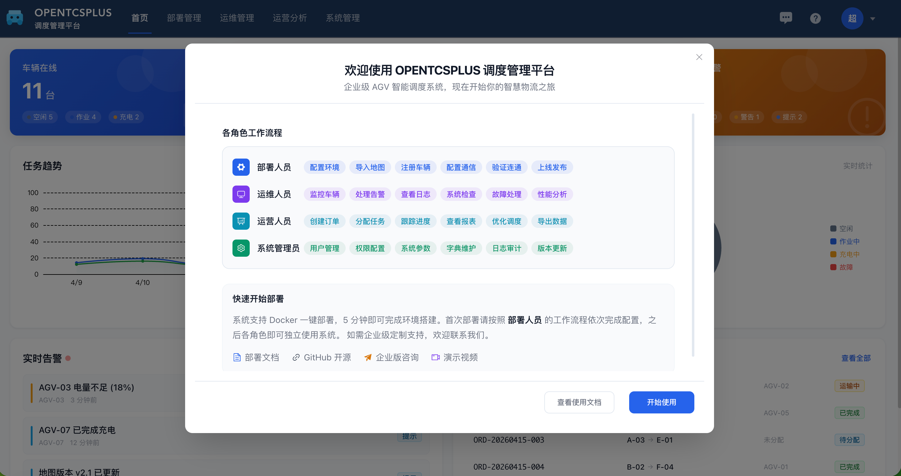
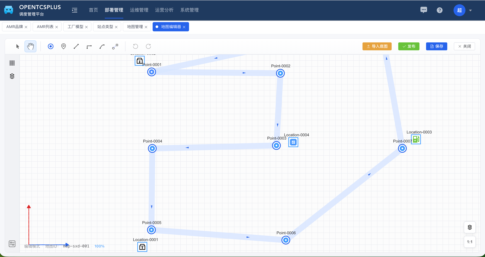
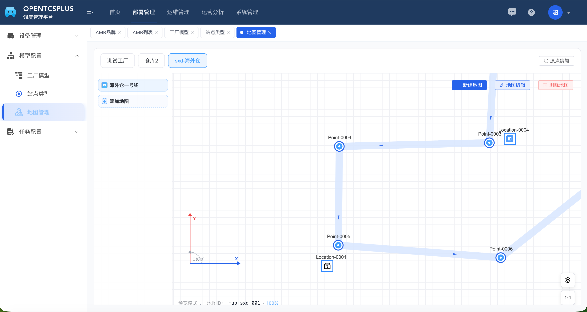
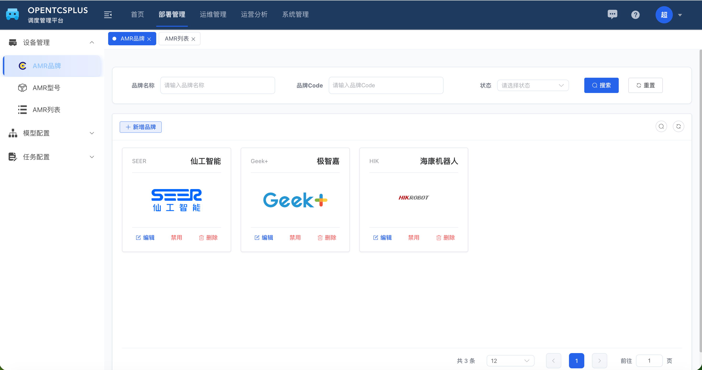
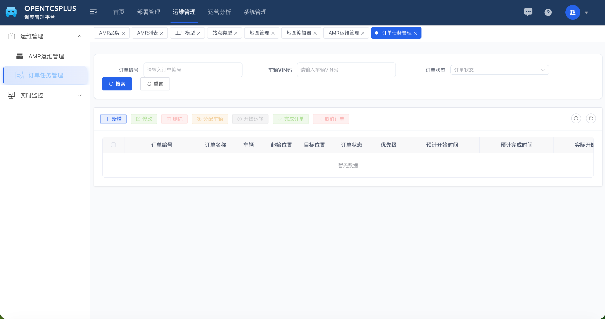

<h1 align="center">OpenTCS Plus Web</h1>

<p align="center">
  <strong>企业级 AGV 调度系统前端 · 开箱即用 · 可视化地图编辑</strong>
</p>

<p align="center">
  <a href="https://opensource.org/licenses/GPL-3.0">
    
  </a>
  
  
  
  
</p>

> **开源协议**：OpenTCS Plus 采用 GPLv3 协议。如果您希望在闭源商业产品中使用，请联系我们获取商业授权。

<p align="center">
  <a href="#在线体验">在线体验</a> ·
  <a href="#功能特性">功能特性</a> ·
  <a href="#快速开始">快速开始</a> ·
  <a href="#项目结构">项目结构</a> ·
  <a href="#关联项目">关联项目</a> ·
  <a href="#贡献指南">贡献指南</a>
</p>

---

## 项目简介

OpenTCS Plus Web 是 [OpenTCS Plus](https://github.com/your-org/opentcs-plus) 后端的配套前端，基于 **Vue 3 + TypeScript + Element Plus** 构建的现代化 AGV（自动导引车）调度管理界面。

项目的核心亮点是**可视化地图编辑器**——支持多楼层地图绘制、点位/路径/区域管理，以及实时仿真监控看板，帮助仓储物流团队快速落地私有化 AGV 调度系统。

> 后端项目：[opentcs-plus](https://github.com/your-org/opentcs-plus)（Spring Boot 3.5 + JDK 21）

---
## 在线体验

> 演示环境仅供功能体验，数据会定期重置。

| 项目 | 内容 |
|------|------|
| 演示地址 | http://106.54.43.41 |
| 默认账号 | `admin` |
| 默认密码 | `admin123` |

---

## 功能特性

### 🗺️ 可视化地图编辑器
- 基于 **Konva.js** 实现的高性能画布渲染
- 支持点位、路径、区域的拖拽式可视化编辑
- 图层管理（底图导入、对象分层控制）
- **跨楼层连接**支持多楼层 AGV 路径规划
- 属性面板实时编辑节点属性

### 🤖 车辆全生命周期管理
- 车辆品牌 / 型号 / 实例的三级管理
- 车辆实时状态追踪

### 📋 订单调度
- 运输订单创建与管理
- 订单执行状态全程可视

### 📊 实时仿真监控
- 车辆状态看板
- 交通流量状态
- 订单执行状态
- 基于 **SSE（Server-Sent Events）** 实现零延迟推送

### ⚙️ 系统管理
- 用户 / 角色 / 菜单权限管理（基于 RuoYi-Vue-Plus）
- 多租户支持
- 动态路由与权限控制

---

## 界面预览

<table>
  <tr>
    <td align="center">
      <br/>
      <sub>首页仪表盘 — 车辆在线、任务趋势、实时告警</sub>
    </td>
    <td align="center">
      <br/>
      <sub>角色工作流引导 — 部署 / 运维 / 运营 / 管理员</sub>
    </td>
  </tr>
  <tr>
    <td align="center">
      <br/>
      <sub>可视化地图编辑器 — 点位、路径、位置类型</sub>
    </td>
    <td align="center">
      <br/>
      <sub>地图管理 — 多工厂、多楼层地图列表</sub>
    </td>
  </tr>
  <tr>
    <td align="center">
      <br/>
      <sub>AMR 品牌管理 — 卡片式品牌展示</sub>
    </td>
    <td align="center">
      <br/>
      <sub>订单任务管理 — 全生命周期调度</sub>
    </td>
  </tr>
</table>

---

## 技术栈

| 分类 | 技术 |
|------|------|
| 前端框架 | Vue 3.5 + Composition API |
| 开发语言 | TypeScript 5.8 |
| UI 组件库 | Element Plus 2.9 |
| 地图渲染 | Konva.js + vue-konva |
| 状态管理 | Pinia 3.0 |
| 路由管理 | Vue Router |
| 实时通信 | SSE（Server-Sent Events） |
| 构建工具 | Vite 6.3 |
| 代码规范 | ESLint + Prettier |

---

## 快速开始

### 环境要求

- Node.js >= 18
- npm >= 9 或 pnpm >= 8（推荐）

### 安装与运行

```bash
# 1. 克隆仓库
git clone https://github.com/your-org/opentcs-plus-web.git
cd opentcs-plus-web

# 2. 安装依赖（国内用户推荐使用镜像）
npm install --registry=https://registry.npmmirror.com

# 3. 启动开发服务器
npm run dev
# 访问 http://localhost:80
```

### 生产构建

```bash
npm run build:prod
```

### 分支说明

| 分支 | 说明 |
|------|------|
| `ts`（默认） | 稳定发布分支，生产可用 |
| `dev` | 开发分支，包含最新功能 |

---

## 项目结构

```
src/
├── api/                        # API 层（类型定义 + Axios 请求）
│   ├── opentcs/
│   │   ├── factory/            # 工厂模型（地图、连接、区块）
│   │   ├── map/                # 地图查询（点位、路径、位置类型）
│   │   ├── ops/amr/            # AMR 运营接口
│   │   ├── order/              # 运输订单
│   │   ├── simulation/         # 仿真控制
│   │   └── vehicle/            # 车辆（品牌 / 型号）
│   ├── system/                 # 系统管理（用户、角色、菜单、字典等）
│   ├── monitor/                # 系统监控（在线用户、操作日志、缓存）
│   └── workflow/               # 工作流（实例、任务）
│
├── views/                      # 页面视图
│   ├── deploy/                 # 部署配置模块
│   │   ├── device/             # 设备管理（品牌 / 型号 / 实例列表）
│   │   ├── factory/            # 工厂配置（地图、位置类型、模型）
│   │   ├── map-editor/         # 可视化地图编辑器（核心功能）
│   │   └── task-config/        # 任务模板配置
│   ├── ops/                    # 运营操作模块
│   │   ├── amr/                # AMR 管理
│   │   ├── monitor/            # 实时监控（直播视图、锁定状态）
│   │   └── order/              # 订单调度
│   ├── analytics/              # 数据分析
│   │   └── stats/              # 统计报表（AMR 统计、任务统计）
│   └── system/                 # 系统管理页面
│       ├── management/         # 用户 / 角色 / 部门 / 菜单等
│       └── monitor/            # 缓存 / 在线用户监控
│
├── components/                 # 公共组件
│   ├── map/                    # 地图相关组件
│   ├── CategoryTopNav/         # 顶部分类导航
│   ├── TopNav/                 # 顶部导航栏
│   ├── Breadcrumb/             # 面包屑
│   └── ...                     # 其他通用组件
│
├── store/modules/              # Pinia 状态管理
│   ├── mapEditor.ts            # 地图编辑器核心状态（画布操作）
│   ├── user.ts                 # 用户认证
│   ├── permission.ts           # 动态路由 / 权限
│   ├── app.ts                  # 应用级状态
│   └── dict.ts                 # 字典数据缓存
│
├── layout/                     # 布局组件（侧边栏、标签页、顶部栏）
├── hooks/                      # 组合式函数（Composables）
├── directive/                  # 自定义指令（权限等）
├── utils/
│   ├── mapEditor/              # 地图编辑器工具函数
│   └── request/                # Axios 封装
├── enums/                      # 枚举常量
├── types/                      # TypeScript 全局类型定义
├── lang/                       # 国际化资源
├── settings/                   # 应用配置（导航分类等）
└── router/                     # 路由配置（动态路由加载）
```

---

## 关联项目

| 项目 | 说明 |
|------|------|
| [opentcs-plus](https://github.com/your-org/opentcs-plus) | 后端核心，Spring Boot 3.5 + JDK 21 |
| [opentcs-plus-docs](https://github.com/your-org/opentcs-plus-docs) | 项目文档（VitePress） |
| [OpenTCS](https://www.opentcs.org/) | 上游开源调度内核 |

---

## 贡献指南

欢迎提交 Issue 和 Pull Request！

### 提交规范

遵循 [Angular Commit 规范](https://www.conventionalcommits.org/zh-hans/)：

| 类型 | 说明 |
|------|------|
| `feat` | 新功能 |
| `fix` | Bug 修复 |
| `docs` | 文档更新 |
| `style` | 代码格式（不影响功能） |
| `refactor` | 代码重构 |
| `perf` | 性能优化 |
| `test` | 测试相关 |
| `chore` | 构建/工具链变更 |

**示例：**
```
feat(map): 添加地图缩放功能
fix(vehicle): 修复车辆状态显示错误
```

### PR 流程

1. Fork 本仓库
2. 从 `ts` 分支创建功能分支：`git checkout -b feat/your-feature`
3. 提交代码（遵循上方规范）
4. 发起 Pull Request 到 `ts` 分支

---

## License

[GPLv3](./LICENSE) © OpenTCS Plus Contributors
